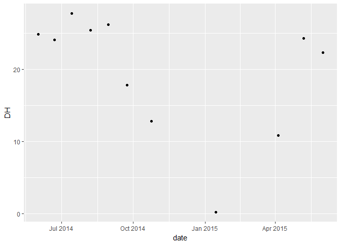
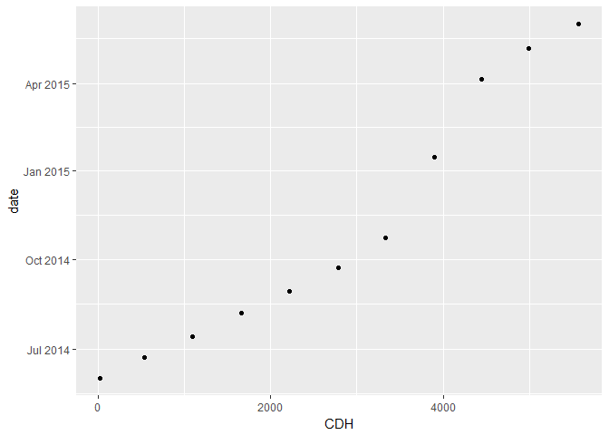

Introduction to the Standard Operating Procedure (SOP):
-------------------------------------------------------

The calculation of Cumulative Degree Hours (CDH) is performed when a
sampling strategy is based on accumulated mean tempertures over a period
of time, rather than employing dedicated time intervals that may contain
variable temperature ranges. This is an important sampling strategy for
field studies when temperature strongly affects the outcome of an
experiment and yet is an uncontrolled variable.

This project involves downloading data from a weather station located at
the UT gardens in order to calculate the CDH. The weather station data
is extensive and the file columns utilized are the following: Year,
Julian date, Hr.Min, and Ambient. Julian date values range from 1-365,
or 1-366 in the case of leap years. Hr.Min consists of hourly notations
in the form of: 100, 200...1100, 1200, ...2400. Ambient is simply
ambient air temperture in degrees C. When supplied a date range, a
minimum of two hourly temperture values, a low temperature threshold,
and the number of anticipated samples required, the program will provide
the following: the total CDH for the duration of the sampling period,
the CDH for the sample interval selected, a printout of the calculated
sampling schedule, and graphs of both daily degree hours as a function
of date, as well as date as a function of CDH in order to visually
assess reasonable sampling patterns.

**Important considerations:** This calculator is designed to utilize
historical data to propose a sampling schedule. It is not designed to
function as a predictive model, except for use as a guide to climate and
temperature behavior. It is possible to maintain DH and CDH values that
are concurrent with an ongoing experiment, although this does
necessitate continual updating of the root Excel .csv file.

The Cumulative Degree Hour Standard Operating Procedure (CDH SOP)
follows below in a paragraph-documented cookbook style format.
Additionally, there are several points where it is possible to extract
internally created dataframes in the event that it is preferable to look
at the data during individual steps in the calculation sequence.

The CDH SOP:
------------

**Step 1: Setup** Download the following test data file that is provided
with this markdown document: `Weather2013_15.csv`.

**Note:** If actual Excel spreadsheet data from a weather station is to
be utilized, there are some important adjustments to be made to the
Excel data prior to use. Spreadsheet files must have any headers removed
except column titles. Column titles of interest must read: Year,
Julian\_day, Hr.Min, and Ambient. Title rows must be unfrozen. If there
is a column entitled ID, this title must be changed prior to conversion
to .csv file formatting, otherwise the file formatting does not happen
correctly (this is an Excel quirk). Finally, resulting data must be
saved as a .csv file.

Ensure that the *tidyverse* and *lubridate* packages are installed.
These packages are required to run this code.

**Step 2: Downloading data and initial dataframe creation** The
following code loads the *tidyverse* and *lubridate* libraries, reads
the data file, and creates a dataframe entitled *weatherdata* that
contains four columns of data: Year, Julian\_day, Hr.Min, Ambient. This
dataframe is large and can be printed to the screen by removing the \#
prior to the final print statement, but will not automatically print
here in the interests of brevity.

**Note:** if another file has been created for use, it will need to be
entered in the 3rd line: `read.csv(file="enter_new_filename_here.csv")`

    suppressMessages(library(tidyverse))
    suppressMessages(library(lubridate))
    weatherdata <- read.csv(file="Weather2013_15.csv") %>%
      select(Year, Julian_day, Hr.Min, Ambient)
    #print(weatherdata) #in order to view weatherdata, remove initial #sign

The following code converts the Julian\_date column into YYYY-MM-DD
format in a two-step process. Julian date ranges from 1-365 or 366, but
does not contain a zero as a starting point. Therefore, an origin must
be set for each year that constitutes the creation of an artificial zero
point on 12-31 of the prior year. The output from this code creates a
new dataframe entitled *weather1* and adds two columns: one column is
the origin, and the next is the date that is created from the combined
Julian\_day and Year columns. This dataframe is large and can be printed
to the screen by removing the \# prior to the final print statement, but
will not automatically print here in the interests of brevity.

    set_origin <- function(yr) {
      as.Date(paste0(yr-1, "-12-31"))
    }

    weather1 <- mutate(weatherdata, 
          origin.date = set_origin(Year), 
          date = as.Date(Julian_day, origin.date))
    #print(weather1)#in order to view weather1, remove initial #sign

**Step 3: Initial Data entry**  
1. Choose a date range and enter it in the first and second lines
between the quotes in the first filter statement
`date >= ymd("2014-06-01") &  date <=ymd("2015-06-01")`. The first line
contains the starting date, and the second line contains the ending
date. Formatting is in the form of "YYYY-MM-DD" **Note:** the dates
listed will be included in the date range selected.

1.  Choose the times at which temperature readings will be taken (100
    and 1300 here) and enter these values into the third line
    `(Hr.Min==XX00)`. Generally this is done at 12-hour intervals at the
    estimated highest and lowest points of the day.

2.  Choose the low temperature threshold. All values below this choice
    will be reset to the selcted value, in this case 0.
    `weather2[weather2<0]=X`

<!-- -->

    weather2 <- filter(weather1, date >= ymd("2014-06-01") &
                    date <= ymd("2015-06-01")) %>% 
      filter(Hr.Min==100 | Hr.Min==1300) 

    #This sets the lower temperature threshold (in this case to zero)
    weather2[weather2<0]=0
    #print(weather2)#in order to view weather2, remove initial #sign

**Step 4: Calculations** The following calculates daily means of the
Ambient temperatures chosen above by the hourly selections from Step 3,
number 2. A new dataframe is created *(calc\_CDH)* that contains these
means in a column entitled DH (degree hours). A final column, CDH
(cumulative degree hours), is a running daily sum of values in the DH
column.

    calc_CDH <- weather2 %>%
      group_by(date) %>%
      summarise(DH=mean(Ambient)) %>%
      mutate(CDH=cumsum(DH)) %>%
      print(calc_CDH)

    ## # A tibble: 366 × 3
    ##          date     DH     CDH
    ##        <date>  <dbl>   <dbl>
    ## 1  2014-06-01 24.850  24.850
    ## 2  2014-06-02 23.940  48.790
    ## 3  2014-06-03 23.480  72.270
    ## 4  2014-06-04 25.205  97.475
    ## 5  2014-06-05 24.030 121.505
    ## 6  2014-06-06 23.195 144.700
    ## 7  2014-06-07 25.365 170.065
    ## 8  2014-06-08 24.120 194.185
    ## 9  2014-06-09 22.255 216.440
    ## 10 2014-06-10 23.975 240.415
    ## # ... with 356 more rows

The following calculation returns the total sum of the DH column, which
is the same as the final value in the CDH column. This is the total
value for cumulative degree hours for the entire study range.

    DHsum <- sum(calc_CDH$DH)
    print(DHsum)

    ## [1] 5567.616

**Step 5: Final data entry** 1. Enter the total number of samples that
will be taken, here there are 11. `sample_rate<-XX`

    sample_rate <- 11

The code below returns the value for the CDH interval between samples.
If this interval is too high or too low, adjust the sample rate above.

    sample_interval_size <- DHsum/(sample_rate-1)
    print(sample_interval_size)

    ## [1] 556.7616

1.  In the start\_row line, change the date within the quotes to equal
    the starting date used in Step 3, number 1, above. The format will
    be YYYY-MM-DD. `start_row <- filter(calc_CDH, date=="YYYY-MM-DD")`

2.  In the for statement below, enter the value for *sample rate-1* used
    above (in this case, 10). `for(i in 1:XX)`

This code creates a new dataframe entitled *sample\_schedule*. It uses
the sample interval size (obtained above), and for each integer multiple
of the interval size it returns the last closest value of the CDH. These
CDH values are then used to select rows from the *calc\_CDH* dataframe
from step 4 and these rows are then bound together into the new
dataframe.

    sample_schedule <- numeric(0)
    start_row <- filter(calc_CDH, date=="2014-06-01")
    sample_schedule <-rbind(sample_schedule, start_row)

    for (i in 1:10) {
      increment <- sample_interval_size*i
      a <-last(calc_CDH$CDH[calc_CDH$CDH <= increment])
      new_row <- filter(calc_CDH, CDH==a)
      sample_schedule <- rbind(sample_schedule, new_row)
    }

**Data outputs** *Calculated Sampling Schedule* The following table

    ## # A tibble: 11 × 3
    ##          date      DH      CDH
    ## *      <date>   <dbl>    <dbl>
    ## 1  2014-06-01 24.8500   24.850
    ## 2  2014-06-22 24.0750  539.000
    ## 3  2014-07-14 27.7150 1095.748
    ## 4  2014-08-07 25.3850 1660.408
    ## 5  2014-08-30 26.2250 2223.098
    ## 6  2014-09-23 17.8300 2781.538
    ## 7  2014-10-24 12.8000 3329.113
    ## 8  2015-01-15  0.2570 3895.821
    ## 9  2015-04-05 10.8535 4442.811
    ## 10 2015-05-07 24.2750 4994.346
    ## 11 2015-06-01 22.3300 5567.616

Degree Hours by Date Within Sampling Timeframe

Date as a Function of CDH

**Discussion**

**Errors**

Upon inspection of the final *sample\_schedule* dataframe, it is
apparent that the returned values for CDH are not exact integer
multiples of the sample interval size. The creation of the
*sample\_schedule* dataframe returns the lowest value within integer
multiples of the sample interval size from the *calc\_CDH* dataframe;
this dataframe has corresponding date entries based on the upstream
filtering and sorting, and therefore does not have intermediate values
that would result in an exact match. While returning an exact multiple
is mathematically possible, from a practical standpoint it also would
return a rigid sampling schedule that would include a variety of sample
times at inconsitent hours of the day and under potentially adverse
weather conditions, not to mention a variety of other problems. Daily
values for DH can easily vary between 10 and 30 based on season.
Therefore, differences from the calculated sample interval that are
greater than 25 may be adjusted by comparing with the *calc\_CDH* table
to select a preferred date.

**Internal Dataframe Outputs**

*Weatherdata:* The weatherdata dataframe is produced by the code in the
Step 2. This dataframe contains the following columns: Year,
Julian\_day, Hr.Min, and Ambient. This is still raw data from the
original Excel spreadsheet. This dataframe can be printed according to
the instructions in the print statement at the bottom of the code chunk.

*weather1:* The weather1 dataframe is produced by the code in Step 2.
This dataframe contains six columns, the same columns in weatherdata
(Year, Julian\_day, Hr.Min, Ambient), but also two additional columns
that transform the Julian dates into actual dates of the form:
YYYY-MM-DD. Those columns are: origin.date, and date. This dataframe can
be printed according to the instructions in the print statement at the
bottom of the code chunk.

*weather2:* The weather 2 dataframe is produced by the code in Step 3,
Nos. 2 and 3. This dataframe contains the same columns as weather1,
however they have now been filtered according to hours selected for
calculating means downstream. This dataframe, after correction for
threshold temperature, can be printed according to the instructions in
the print statement at the bottom of the code chunk.

*calc\_CHD:* This is the first dataframe that is printed to the screen,
and contains the following columns: date, DH, CDH. The date column
contains the adjusted Julian dates calculated in weather1. The DH
(degree hours) column contains the means of the Ambient temperatures
filtered in weather 2. The CDH column contains the rolling sum of the
daily DH.
